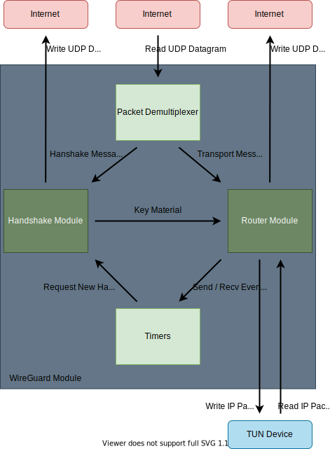

# Rust Implementation of WireGuard

## Usage

Most Linux kernel WireGuard users are used to adding an interface with `ip link add wg0 type wireguard`.
With wireguard-rs, instead simply run:

    $ wireguard-rs wg0

This will create an interface and fork into the background. To remove the interface, use the usual `ip link del wg0`,
or if your system does not support removing interfaces directly, you may instead remove the control socket via
`rm -f /var/run/wireguard/wg0.sock`, which will result in wireguard-rs shutting down.

When an interface is running, you may use `wg(8)` to configure it, as well as the usual `ip(8)` and `ifconfig(8)` commands.

## Platforms

### Linux

This will run on Linux;
however YOU SHOULD NOT RUN THIS ON LINUX. Instead use the kernel module; see the installation page for instructions.

### Windows

Coming soon.

### FreeBSD

Coming soon.

### OpenBSD

Coming soon.

## Building

The wireguard-rs project is targeting the current nightly (although it should also build with stable Rust).

To build wireguard-rs (on supported platforms):

1. Obtain nightly `cargo` and `rustc` through [rustup](https://rustup.rs/)
2. Clone the repository: `git clone https://git.zx2c4.com/wireguard-rs`.
3. Run `cargo build --release` from inside the `wireguard-rs` directory.

## Architecture

This section is intended for those wishing to read/contribute to the code.

WireGuard Rust has a similar separation of concerns as many other implementations of various cryptographic transports:
separating the handshake code from the packet protector.
The handshake module implements an authenticated key-exchange (NoiseIK),
which provides key-material, which is then consumed by the router module (packet protector)
responsible for the actual encapsulation of transport messages (IP packets).
This is illustrated below:

